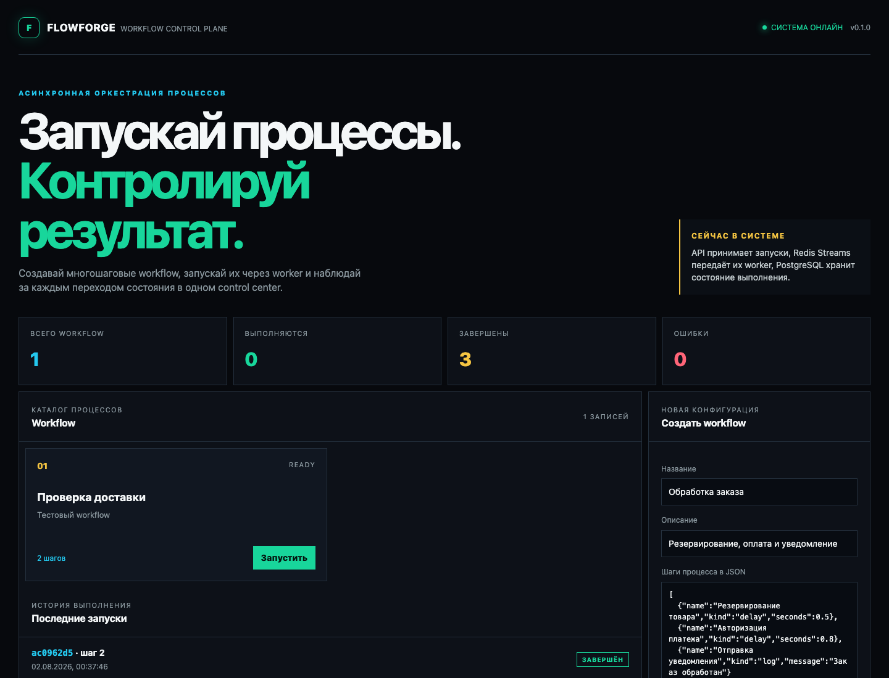
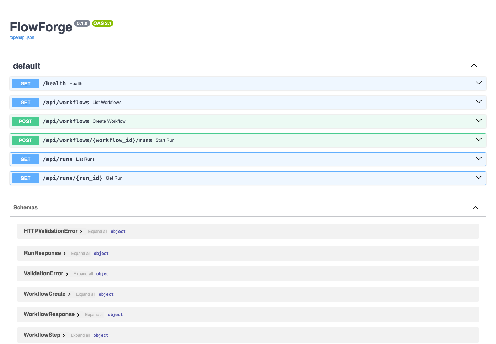

# FlowForge

FlowForge is a Python workflow orchestration platform for running and inspecting
multi-step jobs. The project is designed around durable state, explicit step
transitions and recovery-oriented execution rather than a simple CRUD API.

## Current Slice

The first vertical slice includes:

• FastAPI HTTP API;
• PostgreSQL persistence for workflow definitions and runs;
• a separate Redis Streams worker with `log`, `delay` and intentional `fail` steps;
• run status transitions: `PENDING`, `RUNNING`, `COMPLETED` and `FAILED`;
• retries with exponential backoff and a maximum of three attempts;
• idempotent run creation through the `Idempotency-Key` header;
• Prometheus metrics with HTTP request counters and latency histogram;
• a browser dashboard for creating workflows and starting runs;
• Docker Compose health checks and a reproducible local environment.

The API writes a run to PostgreSQL and publishes its ID to Redis Streams. The
worker consumes the stream and updates the durable run state. Redis consumer
groups provide the delivery boundary; a message is acknowledged only after
the worker finishes processing it. On startup, the worker uses `XAUTOCLAIM` to
recover messages that remained pending after another worker stopped.

The next milestones are leases and heartbeats, transactional outbox, Kafka,
metrics and chaos scenarios. Those pieces will be added only when they
are covered by tests and a runnable demo.

## Run

```bash
docker compose up --build
```

## Preview

### Dashboard



### API documentation



After starting the stack, the dashboard is available at
[http://localhost:8000](http://localhost:8000). API documentation is available
at [http://localhost:8000/docs](http://localhost:8000/docs).

Prometheus metrics are available at [http://localhost:8000/metrics](http://localhost:8000/metrics).

Create a workflow in the dashboard and click `Run`. The run list refreshes
automatically while the workflow is executing. To see a failure, add a step
with `"kind": "fail"` to the JSON definition.

## API Example

```bash
curl -X POST http://localhost:8000/api/workflows \
  -H 'Content-Type: application/json' \
  -d '{
    "name": "demo workflow",
    "description": "A small durable execution example",
    "steps": [
      {"name": "prepare", "kind": "delay", "seconds": 0.2},
      {"name": "notify", "kind": "log", "message": "done"}
    ]
  }'
```

Start a run with the workflow ID from the response:

```bash
curl -X POST http://localhost:8000/api/workflows/<workflow-id>/runs
```

## Development

```bash
python -m venv .venv
. .venv/bin/activate
pip install -e '.[dev]'
pytest
ruff check .
```

The service currently creates the development schema on startup. A later
milestone will replace this with versioned Alembic migrations before adding
more persistent components.
